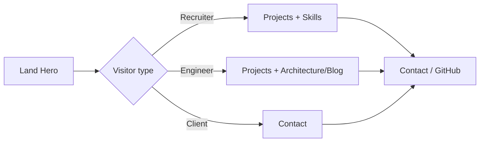

# Step 1: Plan & Define (deep)

This document is the **single source of truth** for *why* the portfolio exists, *who* it serves, *what* each section must prove, and *how* the experience flows before you invest in more design or code.

---

## 1. Decide purpose (choose a primary, allow secondary)

| Mode | What “success” looks like | Tone & proof |
|------|---------------------------|--------------|
| **Job hunting** | Recruiter screens in &lt; 60s; hiring manager books a call | Clarity, impact metrics, role fit, low friction to résumé/LinkedIn/GitHub |
| **Freelance** | Prospect understands offer, sees trust signals, contacts you | Outcomes for clients, process, availability, clear CTA |
| **Showcase** | Peers respect the craft; you control narrative for talks/blog | Depth, tradeoffs, architecture diagrams, OSS links |

**Recommended primary for this codebase:** **Job hunting**, with **showcase** depth in Projects + Blog so senior engineers take you seriously (not “tutorial portfolio”).

**Secondary:** Freelance — if relevant, add one line in Hero or Contact (“Available for selective contract work”) without diluting the main story.

**Write this in one sentence (fill in for yourself):**

> I am building this site so that **[primary audience]** immediately sees that I **[core claim]** and takes **[desired action]**.

*Example:* “… so that **staff+ hiring managers** immediately see that I **ship full-stack systems with strong API and data design** and **book an intro call or read my case studies**.”

---

## 2. Define sections (what each must *prove*)

Your target list: **Hero, Projects, Skills, Architecture, Blog, Contact.**  
Below: **intent, proof, and content checklist** for each.

### Hero

| Item | Detail |
|------|--------|
| **Job** | Answer “who are you and what do you do?” in one glance |
| **Must include** | Name, title (accurate to target role), 1-line value prop, primary CTA (projects or contact), secondary CTA (GitHub / résumé) |
| **Avoid** | Generic adjectives (“passionate,” “hardworking”) without evidence |
| **Motion** | Subtle; must respect `prefers-reduced-motion` (already aligned in codebase) |

**Wireframe intent:** Left/top: headline stack. Right/below: optional visual or code-adjacent motif. Single row of trust chips if you have them (e.g. “TypeScript · PostgreSQL · Next.js”).

### Projects

| Item | Detail |
|------|--------|
| **Job** | Prove you’ve built **non-trivial** software, not clones |
| **Each project should answer** | What was the problem? What did *you* own? What constraints (scale, security, legacy)? What was the outcome? |
| **Data model (your API)** | Title, description, tech stack, images, live URL, GitHub — use **description** as mini case-study (3–5 sentences + bullets in prose), not “this is an app” |
| **Selection rule** | Prefer 3–5 items: mix of **depth** (one flagship) + **breadth** (API, UI, infra) |

**Senior bar:** At least one project mentions **tradeoffs** (e.g. “chose Postgres over X because …”) or **failure mode** (“what we’d do differently”).

### Skills

| Item | Detail |
|------|--------|
| **Job** | Map résumé keywords to **grouped** competencies (not a wall of logos) |
| **Groupings that read well** | Product UI, platform/backend, data, reliability/observability |
| **Avoid** | Listing every library you’ve touched; keep it aligned with target role |

**Source of truth in repo:** `frontend/src/lib/constants.ts` (`skillGroups`) — edit to match your real profile.

### Architecture (dedicated narrative)

This is **not** the same as Skills. Skills = *what* you use. Architecture = *how you think*.

| Item | Detail |
|------|--------|
| **Job** | Show **system design maturity**: boundaries, data flow, security, deployability |
| **Suggested content** | One short “reference architecture” for *this* portfolio (browser → Next.js → Express → Postgres → admin JWT), **or** a diagram + 5 bullets on a flagship work system |
| **Formats** | Simple diagram (Mermaid in blog post, or image), plus bullets: ingress, auth, data stores, background jobs, observability |

**Mapping to current site:** Today, **About** + **Blog** carry part of this. **Plan:** either (a) extend About with an “Architecture” subsection and anchor link `#architecture`, or (b) add a page `/architecture` linked from the nav. *Do not* skip this section mentally — recruiters may not read it; **senior engineers will.**

### Blog

| Item | Detail |
|------|--------|
| **Job** | Proof of clarity, depth, and consistency over time |
| **Post types that work** | Incident/postmortem light, ADR-style decisions, “how we structured X API,” performance notes |
| **Cadence** | Quality &gt; quantity: one strong post beats five shallow ones |

**Repo:** Posts are API-driven; admin can draft/publish.

### Contact

| Item | Detail |
|------|--------|
| **Job** | Lowest friction path to a conversation; spam resistance |
| **Backend** | Submissions stored in DB; rate limited (already). Optional: email notification later |
| **Fields** | Keep minimal: name, email, message; consider optional “intent” (hire / collaborate / other) later |

---

## 3. List projects to showcase (planning table)

Fill this **before** you write final copy in the admin UI.

| Working title | Problem / context | Your ownership | Stack (honest) | Proof (metric, link, screenshot) | Complexity (L/M/H) |
|---------------|-------------------|----------------|----------------|----------------------------------|---------------------|
| | | | | | |
| | | | | | |
| | | | | | |

**Rules:**

- **H** = multi-service, real users, non-trivial data model, or hard constraints (security/perf/legacy).
- At least **one** project should be **H** or strong **M** with a crisp story.
- **Retire** bootcamp clones unless you can articulate a *specific* extension that was non-trivial.

---

## 4. Tech stack decision (planned vs implemented)

### What you wrote vs what the repo uses

| Layer | Your note | This repo |
|-------|-----------|-----------|
| UI | React + Tailwind | **Next.js (React) + Tailwind** |
| Motion | Framer Motion | **Framer Motion** (with reduced-motion guard) |
| Data / auth | Firebase | **PostgreSQL + Express + JWT** (admin CMS) |
| Deploy | Vercel | **Vercel (frontend)** + **Render/Railway (API)** + **managed Postgres** |

**Why this is still “senior”:** BFF/API ownership, SQL, migrations, env-based config, and layered Express code mirror many product companies more closely than a purely Firebase SPA.

### Where Firebase *would* fit (if you pivot later)

- **Firebase Auth** instead of JWT for admin (tradeoff: vendor lock-in vs less custom code).
- **Firestore** instead of Postgres for content (tradeoff: query flexibility vs speed of CRUD).

Document the choice: *“We use Postgres for relational integrity and portable SQL; Firebase was considered for auth-only but deferred to keep one mental model for data.”*

### GitHub Actions (recommended addition — Step 2+)

| Workflow | Value |
|----------|-------|
| **Frontend** | Lint + `next build` on PR |
| **Backend** | Lint + smoke test + migrate check (against ephemeral DB) |
| **Optional** | Deploy on tag to Vercel/Render via secrets |

Not required for Step 1, but **list it in the plan** so CI isn’t an afterthought.

---

## 5. Information architecture & flow

### Primary user journeys



### Nav map (target)

| Route / anchor | Purpose |
|----------------|---------|
| `/` + `#about` | Credibility, positioning |
| `/` + `#skills` | Keyword alignment |
| `/` + `#projects` | Evidence |
| `/` + `#experience` | Timeline (résumé alignment) |
| `/` + `#architecture` or `/architecture` | System thinking *(planned explicit destination)* |
| `/blog` | Depth, writing sample |
| `/` + `#contact` | Conversion |
| `/admin/*` | CMS (not linked prominently in primary nav beyond discreet “Admin”) |

---

## 6. Wireframe sketches (textual — Figma/pen next)

### 6.1 Home — desktop (conceptual)

```
┌─────────────────────────────────────────────────────────────┐
│ [Logo/name]     About  Skills  Projects  Arch  Blog  Contact   [Theme] │
├─────────────────────────────────────────────────────────────┤
│  HERO                                                        │
│  [Eyebrow: availability / focus]                             │
│  [H1: Name]                                                  │
│  [Subtitle: role + one-line value]                           │
│  [Primary CTA]  [Secondary CTA]   [Location / links]         │
├─────────────────────────────────────────────────────────────┤
│  ABOUT                                                       │
│  [Section title + 2 short paragraphs]                        │
│  [3-up cards: stack / principles / collaboration]            │
├─────────────────────────────────────────────────────────────┤
│  SKILLS                                                      │
│  [3 columns: grouped skills + icons]                         │
├─────────────────────────────────────────────────────────────┤
│  PROJECTS                                                    │
│  [2-col cards: image, title, excerpt, tags, links]           │
├─────────────────────────────────────────────────────────────┤
│  EXPERIENCE | EDUCATION                                      │
│  [Timeline]              [Cards]                             │
├─────────────────────────────────────────────────────────────┤
│  BLOG TEASER                                                 │
│  [3 links → /blog]                                           │
├─────────────────────────────────────────────────────────────┤
│  CONTACT                                                     │
│  [Form: name, email, message]                                │
├─────────────────────────────────────────────────────────────┤
│  FOOTER — © socials                                          │
└─────────────────────────────────────────────────────────────┘
```

### 6.2 Mobile

- Stack vertically; nav collapses to hamburger (already).
- Hero: single column; CTAs full-width.
- Projects: single column cards; same content priority.

---

## 7. Content voice & constraints

| Rule | Rationale |
|------|-----------|
| **Lead with outcomes** | Staff+ readers scan for impact |
| **Be specific** | “Improved performance” → “cut p95 API latency from X → Y” where allowed |
| **Own the “I”** | Clear what *you* did vs team |
| **No fake metrics** | Never invent numbers; use qualitative proof if NDA-bound |
| **Accessible** | Semantic headings, contrast, motion preference (already partially enforced) |

---

## 8. Definition of done for Step 1

Step 1 is complete when you have:

- [ ] One-sentence **purpose** (primary audience + claim + action).
- [ ] Filled **project table** (at least 3 rows with real intent).
- [ ] **Skills** groups aligned with target job descriptions.
- [ ] **Architecture** story outlined (diagram + bullets), even if not shipped in UI yet.
- [ ] **Blog** backlog: 3 working titles (optional: one draft in admin).
- [ ] **Wireframe** committed (this doc + Figma/photo of pen sketch).
- [ ] **Stack** decision recorded: implemented stack vs alternatives (Firebase, CI).

---

## 9. Next step preview (Step 2: design system, not random UI)

When you move to Step 2, derive from this plan:

- Typography scale, spacing rhythm, and color roles (already started via CSS tokens).
- Component inventory: Hero variants, project card states, blog typography.
- **Architecture** section UI: diagram + short copy block.

---

*This file is living documentation — update the tables and checkboxes as your job search focus evolves.*
